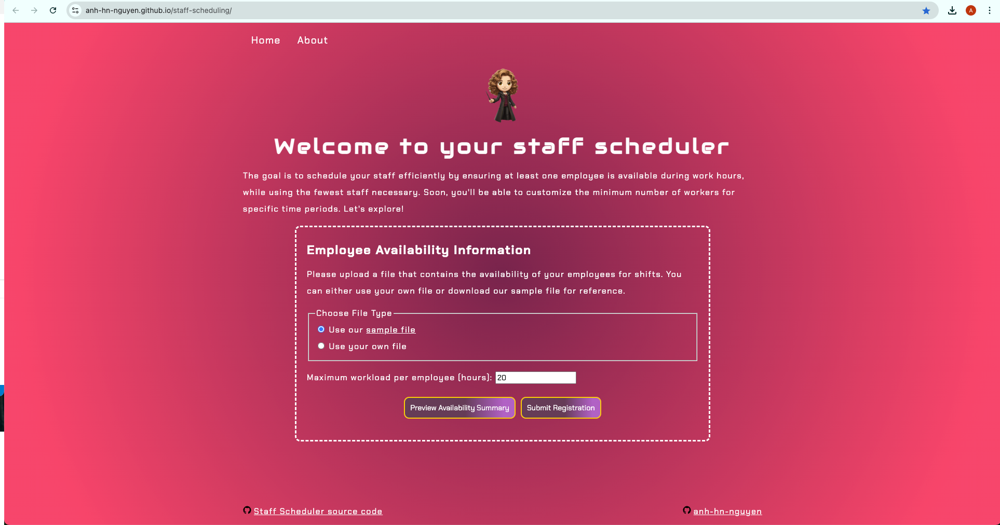
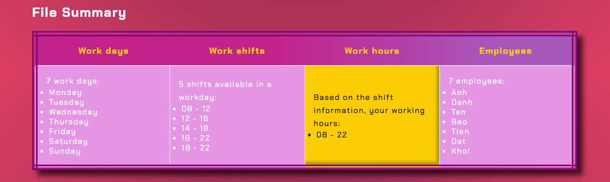
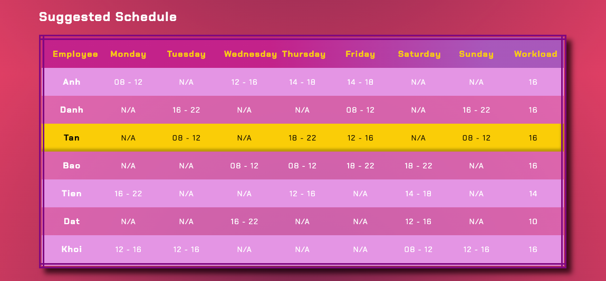

# Staff Scheduler

## What does the app do?

Staff Scheduler helps assigns employees to shifts, ensuring continuous coverage, that is, ensuring that at least one employee is present during work hours, while minimizing staff usage and preventing employee overwork

## Input - Output

### Input

1. Employee shift availability file (required)

- Format: CSV
- Header Row: Contains employee names followed by days of the week (Monday, Tuesday, etc.)
- Cell Content: Each cell indicates an employee's shift availability for that day, represented as a list of time slots (e.g., "08-12;12-16"). Multiple shifts are separated by semicolons, and empty cells indicate no availability

Example:
| Name | Monday                        | Tuesday | Wednesday                          | Thursday                       | Friday                          | Saturday                      | Sunday                          |
|------|-------------------------------|---------|------------------------------------|--------------------------------|----------------------------------|-------------------------------|---------------------------------|
| Anh  | 08-12;12-16;14-18            | 14-18   | 08-12;12-16;14-18;16-22;18-22     | 08-12;12-16;14-18             | 14-18;16-22;18-22              | 08-12;16-22;18-22 | 08-12;12-16  |
| Danh |                               | 16-22   | 16-22                             |                                | 08-12                           | 08-12                         | 16-22                           |

Check out the [full sample file](./data/data.csv)

2. Maximum workload (in hours) per employee (optional) 

### Output

- Summary of the availability file: work days, work hours, employees

- Suggested shedule assignment

## Sample

1. Try the app with [employee availability file](./data/data.csv), maximum workload of 20 hours/employee (per week)

2. View summary information extracted from file

Based on the shifts available in your file, the app calculates your business work hours range from `08-22` every day.

3. View the suggested schedule

The app assigns employees to shifts based on their availability, ensuring at least one employee is present during your work hours (`08-22`), while minimizing staff usage and meeting workload requirements.

## Limitations

- Shifts are restricted to hourly time slots only.

- The minimum number of workers required during any work period is 1, and this setting is not currently adjustable.

## Upcoming changes
- Shifts will be defined in hour and minute time slots.

- The minimum number of workers required during a time period will be customizable.